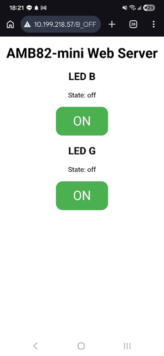
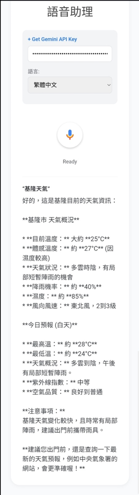
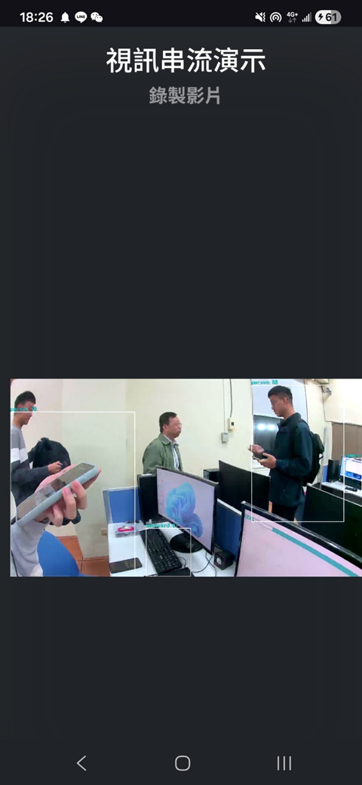
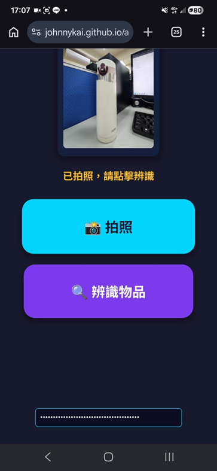
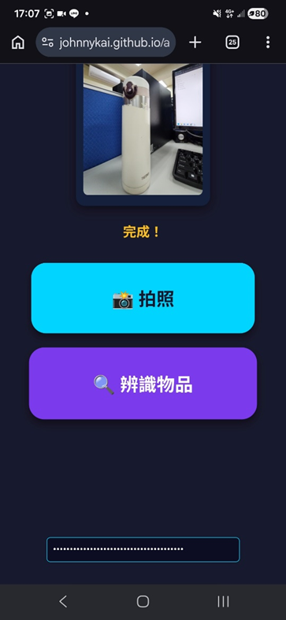
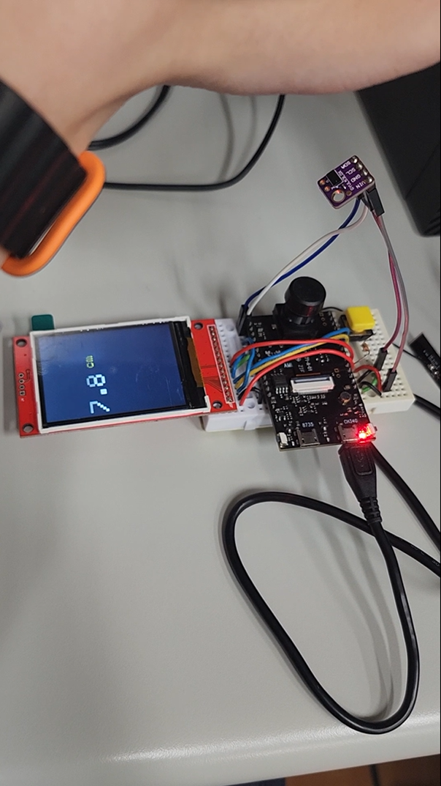
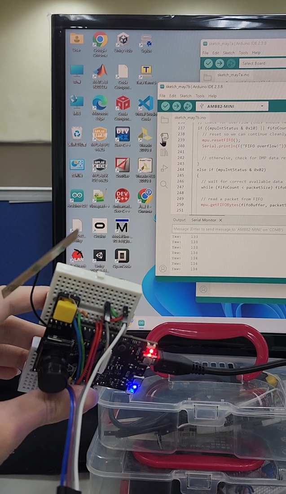
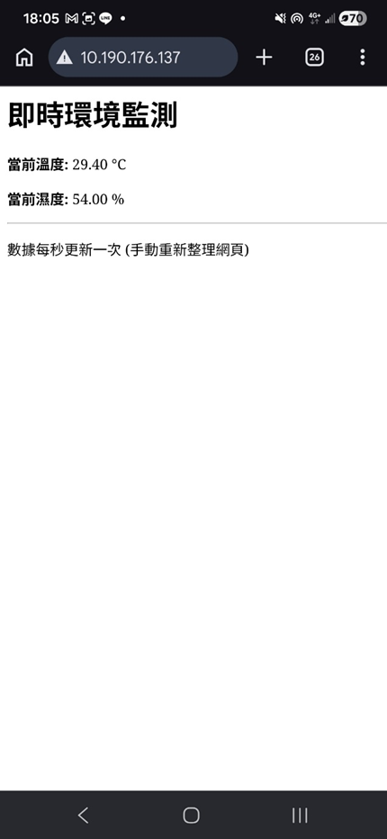
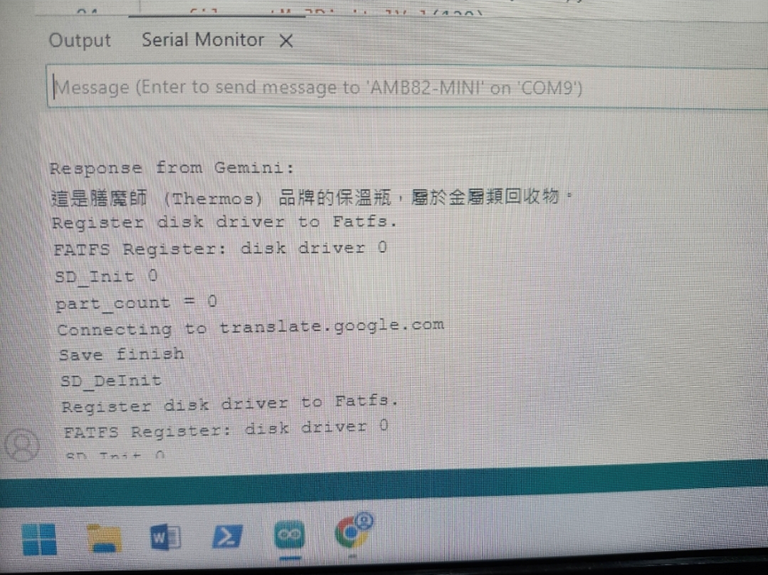

項目一：網頁伺服器雙按鈕控制 LED
🛠️ 開發流程與架構
AI 協同開發：將 WebServer_ControlLED.ino 原始碼提供給 Gemini 或 ChatGPT，請其優化並修改程式架構，使其支援雙獨立虛擬按鈕，分別控制藍色 LED（LED_B）與綠色 LED（LED_G）。

介面與部署：利用 Google AI Studio 或 ChatGPT 生成 HTML 前端介面，並將網頁程式架設（Hosting）於 AMB82-mini 開發板。

遠端操控：手機連線至 AMB82-mini 伺服器，即可透過網頁操作硬體。

📊 成果展示
手機螢幕顯示已成功連線至運行 WebServer_ControlLEDx2 之伺服器網頁，可獨立開關 LED B 與 LED G。
 

項目二：Edge AI 語音助理與氣象查詢
💡 功能說明
系統配置：設定 Gemini API Key 並選擇繁體中文語系。

智慧問答：系統即時串接氣象資訊，以結構化語音與文字回覆氣溫、濕度及今日天氣預報。例如查詢「基隆天氣」時，系統能提供詳細的氣象數據。

 

項目三：YOLOv7 視訊串流物件偵測演示
🧠 核心技術
輕量化偵測：利用 YOLOv7 模型進行即時物件偵測，可辨識人（person）、車輛（car/bicycle/motorcycle/bus/truck）等目標。

實測成果：結合 WebSocket Viewer 技術，在實驗室場域成功捕捉並框列出人員與設備。

 

項目四：視覺輔助智慧物體辨識系統（盲人無障礙優化）
🌐 專案部署流程
GitHub Pages 部署：將 app-visual_assistant 分叉（Fork）至個人帳號。

靜態網頁生成：於 Settings > Pages > Branch 選擇 Main 分支並儲存，生成動態網頁。

♿ 無障礙優化
介面簡化：專為視障人士設計，移除複雜元素，採用高對比大區塊按鈕。

語音反饋：拍照辨識後，系統在 30 字內口語化朗讀物體名稱（如辨識出膳魔師保溫瓶並顯示「完成！」）。

  

項目五：紅外線測距與 TFT 螢幕即時顯示
🔌 實作說明
硬體設定：配置 wire1.begin() 啟用 I2C1 匯流排。

驅動優化：修改 Realtek 硬體支援包中的 VL53L0X.cpp。

數據呈現：於 TFT 螢幕精準顯示測量距離（單位：公分 cm）。

 

項目六：MPU6050 陀螺儀姿態檢測
📐 功能說明
姿態解算：使用 MPU6050 感測器獲取朝向角。

硬體加速：利用 DMP（數位運動處理器）計算目前與水平面的傾斜角度，並於序列埠監視器即時輸出。

 

項目七：物聯網環境溫濕度即時監測
💻 功能實作
數據整合：修改 ReceiveData 範例，將 DHT11 數據嵌入 HTTP 網頁。

遠端監測：手機瀏覽器連線至指定 IP，即可查看即時溫度（℃）與濕度（%）。

 

項目八：生成式 AI 視覺輔助回收物分類系統
♻️ AI 智慧應用
多模態互動：透過相機拍攝回收物，發送提示詞至 Gemini 進行語意分析。

成果驗證：序列埠顯示辨識結果（如：膳魔師保溫瓶屬於金屬類回收物），並完成記憶體註冊與音訊儲存。

 

心得總結與核心學習感想
💡 核心學習感想從「盲目軟體堆疊」到「軟硬體底層整合」：透過手動配置 I2C 匯流排與修改 VL53L0X.cpp 驅動，我深刻體會到理解底層暫存器與驅動協議對於系統優化的重要性。生成式 AI 是開發協同者而非替代者：AI 能高效搭建 HTML 框架，但硬體引腳對接、WiFi 除錯與多模態提示詞優化，仍需紮實的工程素養。以「使用者為本」的技術實踐：在盲人輔助系統中，我學會克制複雜設計，改以極簡 UI 與 TTS 語音，體悟到技術價值在於解決實際痛點。🎯 關鍵技術收穫微處理器與通訊協定：精通 AMB82-mini 之 I2C、SPI 與 HTTP Server 架設。邊緣端 AI 部署：實現 YOLOv7 即時偵測與 WebSocket 視訊串流。多模態雲端協同：完成「影像輸入 $\rightarrow$ 雲端推理 $\rightarrow$ 語音輸出」完整閉環。工程實務能力：熟練掌握 GitHub Pages 快速部署 CI/CD 流程。🚀 總結本次實作帶領我跨越了從傳統 IoT 到 AIoT 的門檻，累積了硬體除錯經驗，並開拓了邊緣運算與雲端大模型協同架構的眼界，為未來的專業發展奠定了堅實基礎。
